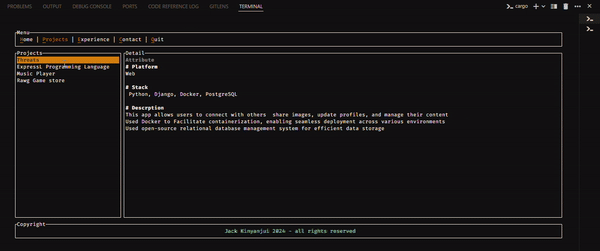

# Rust Resume TUI Project

🚀 This is a Rust project that utilizes the tui-rs  Rust library to display projects and experiences on the terminal

## Demo Gif




## Overview

This project aims to provide a user-friendly interface in the terminal projects and experiences using Rust programming language. It utilizes the TUI library to create an interactive command-line interface.


## Features

- Display a list of projects and experiences
- View detailed information about selected project or experience
- Navigate through the list using keyboard controls

## Installation

1. Clone the repository:

    ```bash
    git clone https://github.com/jck-bit/Resume_cli_Tui.git
    ```

2. Navigate to the project directory:

    ```bash
    cd Resume_cli_Tui
    ```

3. Build the project:

    ```bash
    cargo build
    ```

4. Run the project:

    ```bash
    cargo run
    ```

## Usage

- Press 'p' to view Projects, 'e' to view Experience,'c' to view Contacts and 'h' to go back home.
- Use  'up' and 'down' arrow keys to navigate through the list of projects and experiences.
- Press Esc or q to exit the application.

## Dependencies

- Rust programming language
- TUI library

## Contributing

Contributions are welcome! If you encounter any issues or have suggestions for improvements, please open an issue or submit a pull request.

## License

This project is licensed under the MIT License - see the [LICENSE](LICENSE) file for details.
